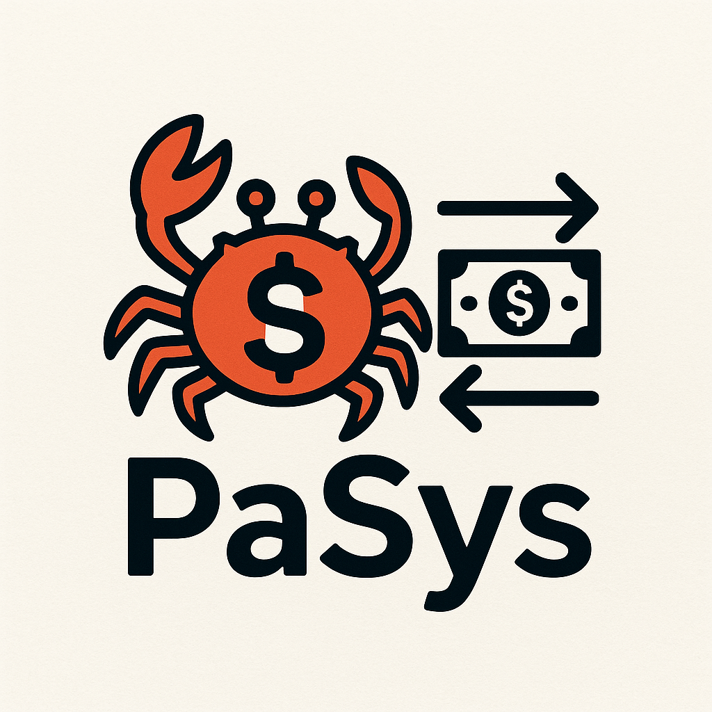
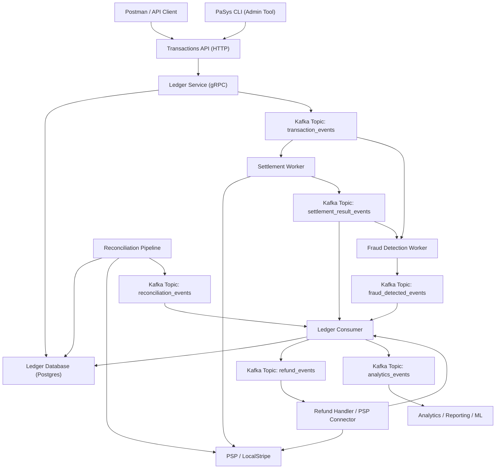
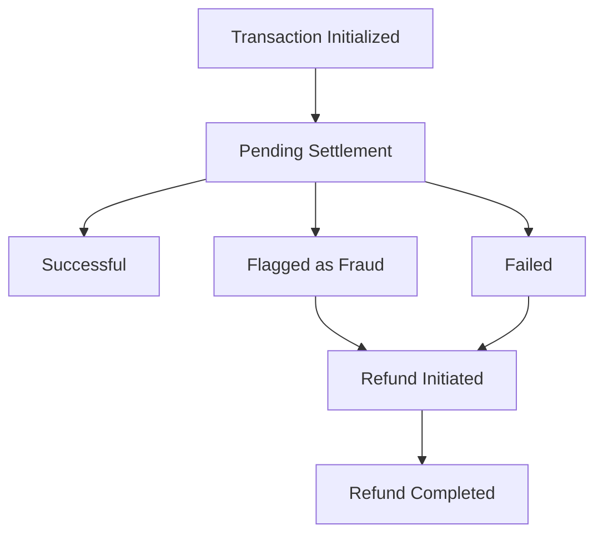

# PaSys - Payment and Settlement System

**PaSys** is a production-grade, event-driven ledger system for money transfers, supporting end-to-end transaction management, settlement, fraud detection, reconciliation, and refunds.  It is written in Rust 🦀

[//]: # (![logo.png]&#40;docs/logo.png&#41;)

---

## Key Features & Highlights

- **Ledger Service (gRPC)**: Core ledger operations with Postgres as the source of truth.
- **Transactions API (HTTP)**: Accepts transaction requests from clients (Postman) or admin tools (PaSys CLI).
- **Event-driven architecture**: Uses Kafka topics for asynchronous workflows between settlement, fraud, reconciliation, and refund handlers.
- **Settlement Worker**: Interfaces with external PSP (LocalStripe) to validate and settle transactions.
- **Fraud Detection Worker**: Monitors transaction events to block suspicious activity.
- **Reconciliation Pipeline**: Periodically compares ledger data with PSP to detect discrepancies and triggers ledger updates via events.
- **Ledger Consumer**: Applies all asynchronous events to the ledger database and publishes analytics/refund events.
- **Refund Handler**: Supports both automatic and manual refund flows through PSP.
- **Analytics Integration**: Publishes transaction and event data for reporting or ML pipelines.
- **ACID double-entry ledger** for correctness and auditability
- **Idempotency, reconciliation, and refund support**
- **Modular Rust workspace** for maintainable and testable code

---

## Architecture

### 1. External Clients / Admin Tools
- **Postman / API Client**: Simulates external users sending transaction requests.
- **PaSys CLI**: Admin tool for managing transactions, refunds, or triggering reconciliation.
- Both interact with the **Transactions API (HTTP)**.

### 2. Transactions API
- Exposes **HTTP endpoints** for transaction requests.
- Sends requests to the **Ledger Service (gRPC)** for processing.
- Acts as the entry point into the system.

### 3. Ledger Service (gRPC)
- Core of the system, responsible for **ledger operations**.
- Uses **Postgres** as the source of truth (double-entry ledger).
- Publishes **transaction events to Kafka** for asynchronous processing.

### 4. Kafka Topics / Event Bus
- Central messaging system for asynchronous flows:
    - `transaction_events` → for settlement and fraud detection
    - `settlement_result_events` → results of settlement
    - `fraud_detected_events` → fraud alerts
    - `reconciliation_events` → reconciliation results
    - `refund_events` → refund requests
    - `analytics_events` → for reporting / ML pipelines

### 5. Workers / Consumers
- **Settlement Worker**: Interacts with PSP / LocalStripe to validate and settle transactions.
- **Fraud Detection Worker**: Monitors events for suspicious activity.
- **Reconciliation Pipeline**: Reads ledger DB and PSP data, identifies discrepancies, and publishes reconciliation events.
- **Ledger Consumer**: Applies all asynchronous events to the ledger DB, triggers refunds, and publishes analytics.
- **Refund Handler**: Processes refunds automatically or flags for manual review via PSP.
- **Analytics**: Consumes events for reporting or ML pipelines.

### 6. Ledger Database
- Central store for **all transaction records, balances, and status updates**.
- Updated both **synchronously by Ledger Service** and **asynchronously via Ledger Consumer**.

### Summary
1. Client submits transaction → API → Ledger Service → Ledger DB & Kafka.
2. Settlement & Fraud workers process transaction events → produce results to Kafka.
3. Ledger Consumer applies events → updates ledger DB, triggers refunds if needed.
4. Reconciliation periodically reads ledger DB + PSP → publishes reconciliation events → Ledger Consumer updates ledger.
5. Analytics consumes events for reporting / ML.

#### Transaction Status Lifecycle

---

## Project Structure

- `ledger-core` – library crate with core ledger logic: accounts, transactions, balances, idempotency, validation.
- `transactions-api` – HTTP service exposed to external clients and applications.
- `ledger` – gRPC ledger service using `ledger-core`.
- `ledger-consumer` – kafka consumer applying asynchronous events to the ledger database.
- `fraud-detector` – kafka consumer for real-time fraud detection using ML models backed by `j.a.m.s`
- `settlement-processor` – kafka consumer processing settlement events with PSP.
- `refund-processor` – kafka consumer processing refunds automatically or manually.
- `pasys` – CLI application to start the system, interact with APIs, and run administrative tasks.
- `docs` – Documentation and assets (e.g., logo).

---

## Tech Stack & Concepts Demonstrated
- Rust: Ledger Library, gRPC & HTTP APIs, Kafka Consumers
- gRPC: Ledger Service for internal communication
- HTTP: Transactions API for external clients / CLI
- Postgres: Ledger Database
- Kafka: Event-driven design, asynchronous flows
- Finance-grade reliability: double-entry ledger, idempotency, reconciliation, refund handling