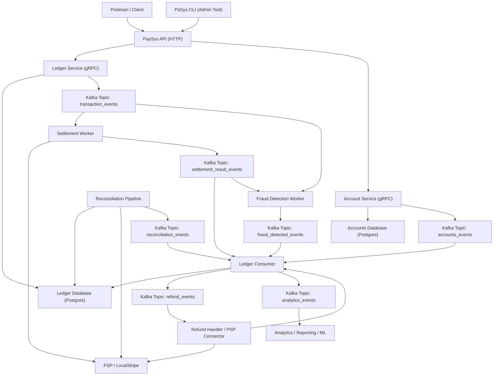
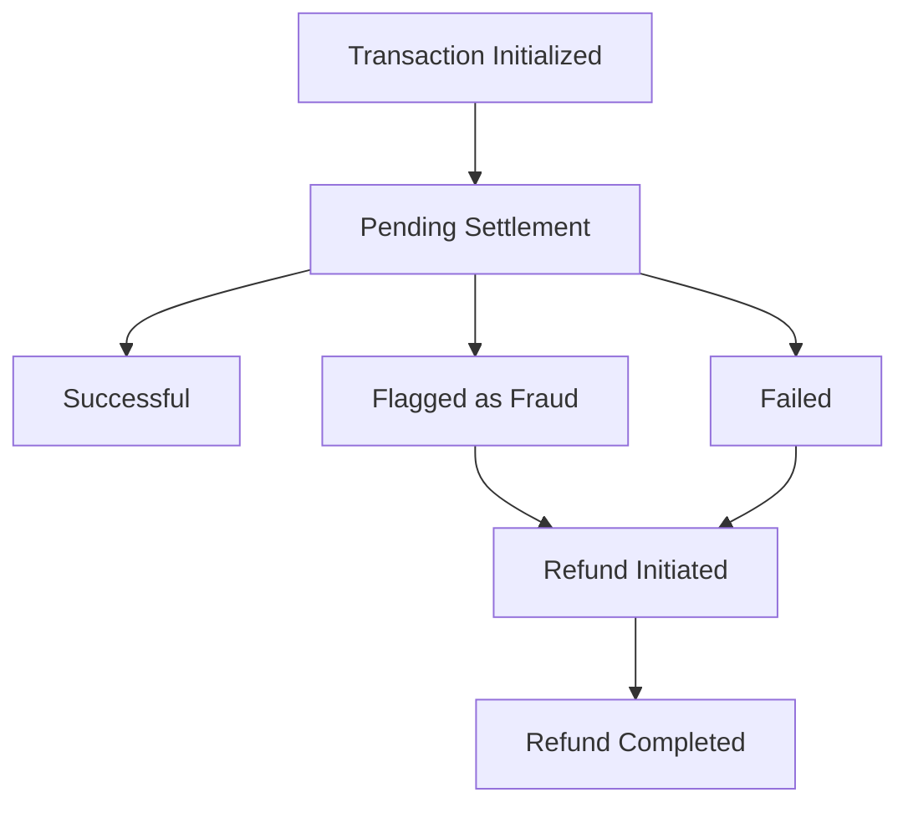

# PaSys - Payment and Settlement System

**PaSys** is a production-grade, event-driven ledger system for money transfers, supporting end-to-end transaction management, settlement, fraud detection, reconciliation, and refunds.  It is written in Rust 🦀

[//]: # (![logo.png]&#40;docs/logo.png&#41;)

---

## Key Features & Highlights

- **Ledger Service (gRPC)**: Core ledger operations with Postgres as the source of truth.
- **Transactions API (HTTP)**: Accepts transaction requests from clients (Postman) or admin tools (PaSys CLI).
- **Event-driven architecture**: Uses Kafka topics for asynchronous workflows between settlement, fraud, reconciliation, and refund handlers.
- **Settlement Worker**: Interfaces with external PSP (LocalStripe) to validate and settle transactions.
- **Fraud Detection Worker**: Monitors transaction events to block suspicious activity.
- **Reconciliation Pipeline**: Periodically compares ledger data with PSP to detect discrepancies and triggers ledger updates via events.
- **Ledger Consumer**: Applies all asynchronous events to the ledger database and publishes analytics/refund events.
- **Refund Handler**: Supports both automatic and manual refund flows through PSP.
- **Analytics Integration**: Publishes transaction and event data for reporting or ML pipelines.
- **ACID double-entry ledger** for correctness and auditability
- **Idempotency, reconciliation, and refund support**
- **Modular Rust workspace** for maintainable and testable code

---

## Architecture

### 1. External Clients / Admin Tools
- **Postman / API Client**: Simulates external users sending transaction requests.
- **PaSys CLI**: Admin tool for managing transactions, accounts, refunds, or triggering reconciliation.
- Both interact with the **PaySys API (HTTP)**.

### 2. PaySys API (HTTP)
- Exposes **HTTP endpoints** for transaction and account operations.
- Sends requests to backend **gRPC services**:
  - `Ledger Service` → handles ledger operations
  - `Accounts Service` → manages account creation and lookups
- Performs input validation, authentication, and request orchestration.
- Acts as the **external entry point** into the system.

### 3. Accounts Service (gRPC)
- Responsible for **creating and querying accounts**.
- Publishes **account events** to Kafka (`accounts_events`) when accounts are created or updated.
- The **Ledger Consumer** listens to these events to maintain account state in the ledger database.

### 4. Ledger Service (gRPC)
- Core of the system, responsible for **ledger operations** (double-entry bookkeeping).
- Uses **Ledger Database (Postgres)** as the source of truth.
- Publishes **transaction events** to Kafka for asynchronous processing.

### 5. Kafka Topics / Event Bus
- Central messaging system for asynchronous flows:
  - `accounts_events` → account creation/updates
  - `transaction_events` → new transactions for settlement and fraud detection
  - `settlement_result_events` → results of settlement processing
  - `fraud_detected_events` → fraud alerts
  - `reconciliation_events` → reconciliation results
  - `refund_events` → refund requests
  - `analytics_events` → for reporting / ML pipelines

### 6. Workers / Consumers
- **Ledger Consumer**: Maintains ledger DB by applying account and transaction events; triggers refunds; publishes analytics events.
- **Settlement Worker**: Interacts with PSP / LocalStripe to validate and settle transactions; publishes results to Kafka.
- **Fraud Detection Worker**: Monitors transaction events for suspicious activity; publishes alerts.
- **Reconciliation Pipeline**: Reads ledger DB + PSP data, identifies discrepancies, and publishes reconciliation events.
- **Refund Handler**: Processes refunds automatically or flags for manual review via PSP.
- **Analytics**: Consumes events for reporting, dashboards, or ML pipelines.

### 7. Databases
- **Ledger Database**: Stores **all transactions, balances, statuses, and account snapshots**. Updated synchronously by Ledger Service and asynchronously by Ledger Consumer.
- **Accounts Database**: Stores **authoritative account information**, created by Accounts Service. Events propagate to the ledger asynchronously.

### Summary Flow
1. Client submits transaction or account request → PaySys API → appropriate gRPC service → databases & Kafka events.
2. Accounts Service emits `accounts_events` → Ledger Consumer updates ledger DB.
3. Ledger Service emits `transaction_events` → Settlement & Fraud Workers process and produce results → Ledger Consumer updates ledger DB and triggers refunds.
4. Reconciliation periodically reads ledger DB + PSP → produces `reconciliation_events` → Ledger Consumer updates ledger.
5. Analytics consumes events for reporting and ML pipelines.

#### Transaction Status Lifecycle

---

## Project Structure

- `pasys-api` – HTTP service exposed to external clients and applications.
- `accounts-proto`: library crate for generated rust code for protos defined in `proto/paysys/v1/accounts.proto`
- `ledger-proto`: library crate for generated rust code for protos defined in `proto/paysys/v1/ledger.proto`
- `accounts`: gRPC accounts service for account management using `accounts-proto` and `pasysy-core` 
- `ledger` – gRPC ledger service using `ledger-proto` and `pasys-core`.
- `ledger-consumer` – kafka consumer applying asynchronous events to the ledger database.
- `fraud-detector` – kafka consumer for real-time fraud detection using ML models backed by `j.a.m.s`
- `settlement-processor` – kafka consumer processing settlement events with PSP.
- `refund-processor` – kafka consumer processing refunds automatically or manually.
- `pasys` – CLI application to start the system, interact with APIs, and run administrative tasks.
- `protos` - Proto files for the project  
- `docs` – Documentation and assets (e.g., logo).

---

## Tech Stack & Concepts Demonstrated
- Rust: Ledger Library, gRPC & HTTP APIs, Kafka Consumers
- gRPC: Ledger Service for internal communication
- HTTP: Transactions API for external clients / CLI
- Postgres: Ledger Database
- Kafka: Event-driven design, asynchronous flows
- Finance-grade reliability: double-entry ledger, idempotency, reconciliation, refund handling